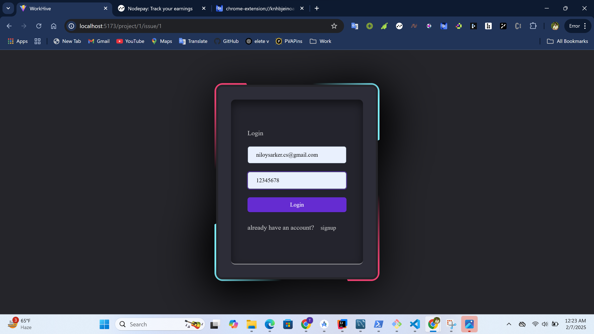
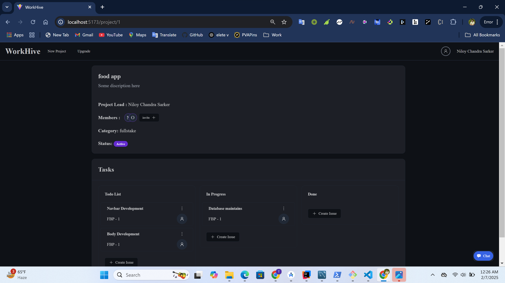
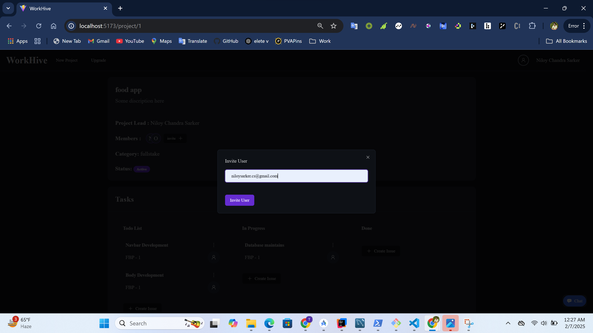
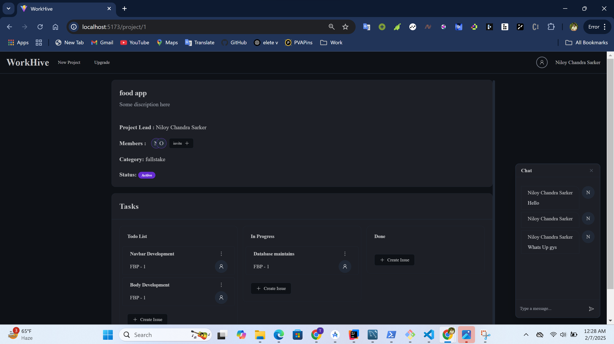
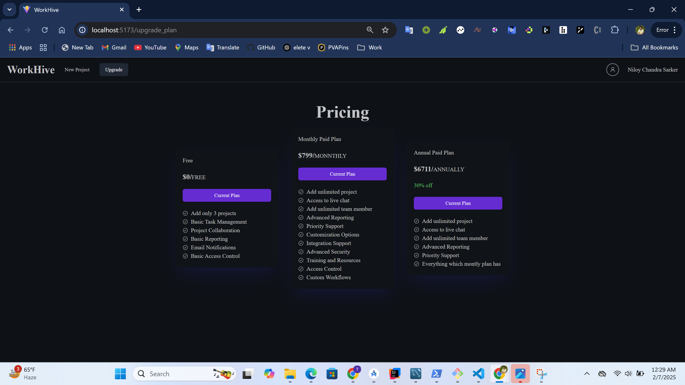

# 🚀 Workhive - Project Management System  

**A powerful project management system built with React & Spring Boot**  

 

## 📌 Overview  
Workhive is a **full-stack project management platform** designed to help teams collaborate efficiently. Whether you're an experienced developer or a beginner, **Workhive** provides the perfect environment to **manage projects, track progress, and collaborate seamlessly**.  

## 🎯 Key Features  
✅ **Project Creation & Management** – Easily create and manage projects.  
✅ **User Invitation System** – Add team members to collaborate on projects.  
✅ **Issue Tracking & Resolution** – Assign and resolve project issues efficiently.  
✅ **Comment System** – Improve teamwork with feedback and discussions.  
✅ **Real-time Chat** – Communicate with team members seamlessly.  
✅ **Progress Tracking** – Monitor project milestones and completion status.  

## 🖼️ Screenshots  

### 🔹 Sign In  
  

### 🔹 Sign Up  
  

### 🔹 Dashboard  
  

### 🔹 Project Creation  
  

### 🔹 Project Details 
  

### 🔹 User Invitation  
  

### 🔹 Chating
  

### 🔹 Issue Details  
  

### 🔹 Upgrade
  


## 🛠 Technology Stack  

| Category       | Technology  |
|---------------|------------|
| **Backend**   | Spring Boot, Spring Security, JWT Authentication |
| **Database**  | MySQL |
| **Frontend**  | React, Redux, Tailwind CSS, Shadcn UI |
| **Routing**   | React Router DOM |
| **Messaging** | RabbitMQ |

## 📌 Additional Features  
🔎 **Search & Filter** – Implement advanced search and filtering options.  
📱 **Responsive Design** – Works seamlessly on all devices.  

## 🚀 Getting Started  

### 1️⃣ Clone the Repository  
```bash
git clone https://github.com/your-username/workhive.git
cd workhive
